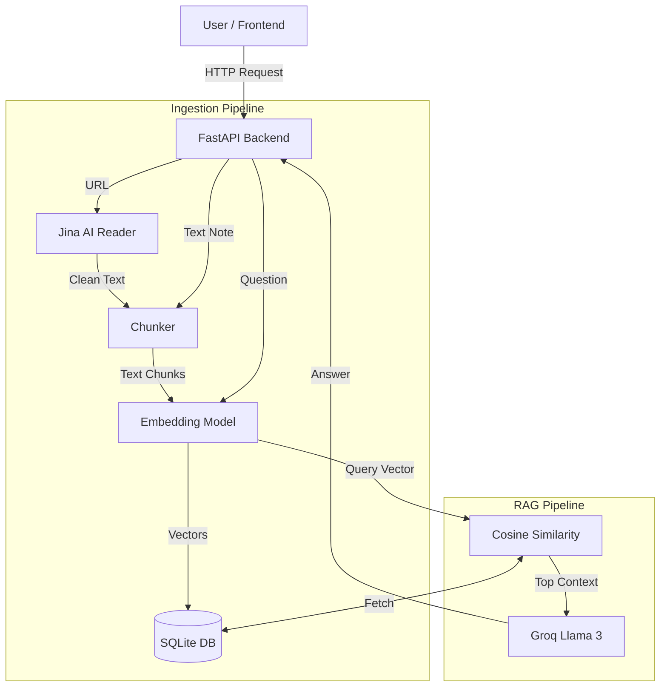

# 🧠 AI Knowledge Box

> **Interview Task Submission**: A minimal, production-style RAG web app.

**Live Demo:** [Frontend](https://turium-ai-project.vercel.app) | [Backend](https://ai-knowledge-box.onrender.com/docs)

---

## 🎯 Goal
Build a small production-style web app that lets users:
1. Save short notes or URLs.
2. Ask questions over their saved content.
3. Get answers powered by a simple RAG pipeline.

**Status:** ✅ Completed (Frontend + Backend + AI Integration + Deployment)

---

## 🛠 Features & Requirements Met

### 1. Content Ingestion
- [x] **Add Text Notes**: Simple text input for raw notes.
- [x] **Add URLs**: Server-side fetching using **Jina AI Reader** to extract clean markdown from any URL.
- [x] **Storage**: SQLite database storing raw content, timestamps, and source types.

### 2. Semantic Search + RAG
- [x] **Chunking Strategy**: Fixed-size window (800 chars) with overlap (100 chars).
  - *Rationale*: Preserves context at boundaries without overcomplicating retrieval.
- [x] **Embeddings**: Jina AI Embeddings API (`jina-embeddings-v3`).
  - *Choice*: Cloud-based, saves ~500MB RAM vs local models, 768d vectors, optimized for RAG.
  - *Benefit*: Fits in Render's free tier (512MB), faster startup, better quality.
- [x] **Vector Storage**: JSON serialization in SQLite.
  - *Tradeoff*: Simple to implement without extra infrastructure/Docker, though linear scan scales poorly beyond ~10k chunks.
- [x] **LLM Integration**: Groq API (`llama-3.3-70b`) for ultra-fast inference.
- [x] **Citations**: Returns source snippets with similarity scores (hidden in UI by default for cleanliness, but available in API).

### 3. Frontend (React + Vite)
- [x] **Clean UI**: Dark mode, professional aesthetics matching Turium branding.
- [x] **State Management**: React Hooks (`useState`, `useEffect`).
- [x] **Interactions**: Tabbed interface, loading states, error handling.

### 4. API Design (FastAPI)
- `POST /ingest`: Accepts JSON `{"content": "...", "url": "..."}`. Validates input.
- `GET /items`: Returns list of ingested content with metadata.
- `POST /query`: Accepts `{"question": "..."}`. Returns answer and sources.
- **Quality**: Pydantic models for validation, proper HTTP error codes (400, 500), and structured logging.

---

## 🏗 Architecture



---

## 🧠 Design Decisions & Tradeoffs

### 1. Chunking Strategy
- **Current**: Simple sliding window (800 chars, 100 overlap).
- **Pro**: Easy to implement, predictable.
- **Con**: Does not respect semantic boundaries (sentences/paragraphs).
- **Production Change**: Use `RecursiveCharacterTextSplitter` (LangChain) or semantic chunking based on embedding similarity.

### 2. Vector Store (SQLite)
- **Current**: Accessing vectors stored as JSON strings in SQLite.
- **Pro**: Zero external dependencies, single file database, perfect for "minimal" requirement.
- **Con**: Linear search complexity O(N). SLOW at large scale.
- **Production Change**: pgvector (PostgreSQL), Pinecone, or Weaviate for HNSW indexing (approximate nearest neighbor).

### 3. Scalability (What breaks?)
- **Latency**: Searching detailed vectors in SQLite will become noticeably slow >10k chunks.
- **Context Window**: Simple concatenation of chunks might exceed LLM context limit if not managed.
- **Formatting**: Complex PDFs or heavy JS websites usually fail simple scrapers. Jina AI helps, but isn't perfect.

---

## 🚀 Setup & Run Locally

### Backend
```bash
cd backend
python -m venv venv
source venv/bin/activate
pip install -r requirements.txt

# Create .env file with your API keys:
# GROQ_API_KEY=your_groq_key (get from https://console.groq.com/keys)
# JINA_API_KEY=your_jina_key (get from https://jina.ai/)

uvicorn main:app --reload
```

### Frontend
```bash
cd frontend/vite-project
npm install
npm run dev
```

---

## 📦 Deployment Guide

### Backend (Render)
Hosted on Render as a Web Service.
- **Build Command**: `pip install --prefer-binary -r requirements.txt`
- **Start Command**: `uvicorn main:app --host 0.0.0.0 --port $PORT`
- **Env Vars**: 
  - `GROQ_API_KEY` (required)
  - `JINA_API_KEY` (required)
- **Memory**: Optimized to use ~50MB (down from ~550MB) by using API-based embeddings

### Frontend (Vercel)
Hosted on Vercel, connected to GitHub.
- **Build Command**: `npm run build`
- **Output Directory**: `dist`

---

**Author**: Prakhar Pandey
**Timebox**: ~8 hours
